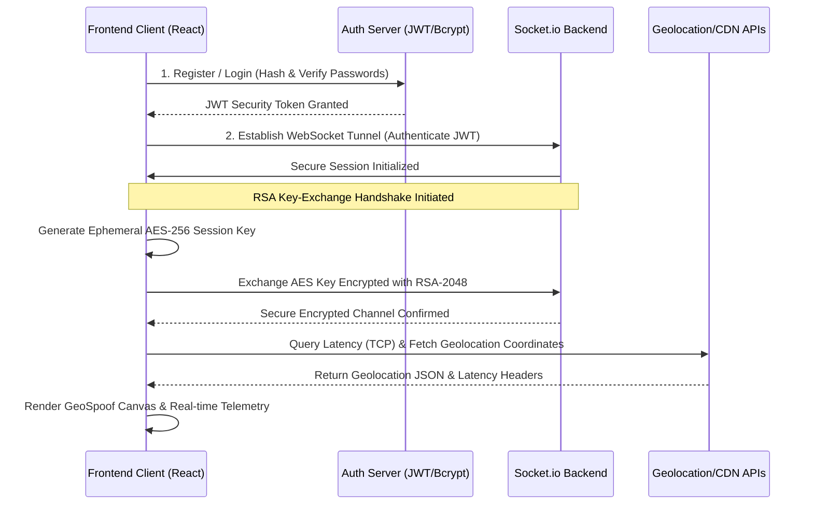

# ⬡ NEXVPN-Nova — Next-Gen Cyber-Privacy & VPN Simulation Suite

NEXVPN-Nova is an advanced, high-performance, full-stack cyber-security simulation dashboard. It features live network telemetry, real cryptographic handshakes, dynamic vulnerability detection, interactive threat intelligence feeds, WebRTC/DNS leak vectors, and custom canvas-based geo-spoof mapping.

Developed with a modern cyberpunk aesthetic (powered by customized design themes and responsive typography), NEXVPN-Nova simulates and measures enterprise-grade virtual private network operations right from your browser.

---

## 🚀 Key Innovation Highlights

*   **🛡️ Dynamic Privacy Score Engine**: A real-time 0–100 privacy health score driven by active security layers, rendered dynamically using HTML5 Canvas with smooth arc-fill micro-animations.
*   **🗺️ Interactive GeoSpoof Visualizer**: An animated world map that tracks and maps your simulated data tunnel from your physical IP geolocation to your target VPN exit-node, utilizing vectorized canvas drawing and dashed signal pulses.
*   **🔒 Encrypted Chat (AES-256-CBC + RSA-2048)**: A live peer-to-peer websocket chat where clients negotiate ephemeral AES-256 session keys using 2048-bit RSA public/private key pairs. Messages are encrypted locally on the frontend, transmitted as ciphertext over WebSockets, and decrypted only by the authorized recipient.
*   **⚡ Real-Time Speed & Latency Profilers**: Integrated network tests executing real TCP/HTTP handshakes against CDN nodes (Cloudflare CDN 2MB speed payloads) to report active download speeds, packet loss ratios, and server-by-server latencies.
*   **🔍 Vulnerability Detection Suite**: Active testers identifying real WebRTC local candidate leaks and checking for DNS exposures outside secure network channels.
*   **☠️ Threat Intelligence Center**: An automated simulated event feed listing blocklists, tracking cookies, and real-time IP/Domain reputation reports.

---

## 🛠️ Technology Stack & Architecture

### Frontend
*   **Core framework**: React.js (v18.2.0)
*   **State & Routing**: React Router DOM (v6.18.0)
*   **Network & API Communications**: Axios (v1.6.0)
*   **Real-time Handshakes**: Socket.io-client (v4.7.2)
*   **Cryptography & Decryption**: Crypto-JS (v4.2.0)
*   **Visualizations**: Custom Canvas API & vanilla CSS design tokens (using Outfit, Syne, and JetBrains Mono typography).

### Backend
*   **Server Runtime**: Node.js & Express (v4.18.2)
*   **Bi-directional Communication**: Socket.io (v4.5.4)
*   **Authentication & Hashing**: JSON Web Tokens (JWT v9.0.0) & Bcryptjs (v2.4.3)
*   **System Telemetry**: Built-in Node network/OS API modules (`crypto`, `net`, `dns`, `os`)

---

## 📦 System Architecture Diagram



---

## 📂 Project Structure

```
NEXVPN/
├── backend/                  # Node.js Server Environment
│   ├── config/               # Configuration settings & environment load
│   ├── routes/               # API Router endpoints (auth, telemetry, scans)
│   ├── server.js             # Main server entry & socket management
│   └── package.json          # Node dependencies & run scripts
└── frontend/                 # React Client Application
    ├── public/               # Public assets, icons, and indices
    ├── src/
    │   ├── components/       # Reusable Dashboard & Widget Components
    │   ├── context/          # React State Providers (Auth, Socket)
    │   ├── utils/            # Cryptographic & testing helper scripts
    │   ├── index.css         # Global cyberpunk styling & layout setup
    │   └── App.js            # Router mapping & layout manager
    └── package.json          # React dependencies & scripts
```

---

## ⚙️ Local Setup and Installation

Follow these steps to run the NEXVPN-Nova suite locally on your computer.

### Prerequisites
*   **Node.js** (v16.x or newer installed)
*   **npm** (v8.x or newer)

---

### Step 1: Clone and Clean Setup
To configure NEXVPN-Nova as a brand new repository, initialize the folder from scratch:
```bash
# Initialize a fresh git repository
git init
```

### Step 2: Configure & Start the Backend
1. Go to the `backend/` directory:
   ```bash
   cd backend
   ```
2. Install package dependencies:
   ```bash
   npm install
   ```
3. Set up environment variables. Create a `.env` file in the `backend/` folder:
   ```env
   PORT=3001
   JWT_SECRET=super_secure_nexvpn_nova_secret_key_9988
   ```
4. Launch the backend:
   ```bash
   npm run dev   # Runs with nodemon auto-restart
   # or
   npm start
   ```
   You should see: `✅ NEXVPN Backend running! (Port: 3001)`

---

### Step 3: Configure & Start the Frontend
1. Open a new terminal and go to the `frontend/` directory:
   ```bash
   cd frontend
   ```
2. Install dependencies:
   ```bash
   npm install
   ```
3. Run the development server:
   ```bash
   npm start
   ```
   The browser will open automatically to `http://localhost:3000`.

---

## ⚡ Deployment & Production Operations

### Backend (e.g. Render / Heroku)
The backend is optimized for deployment to cloud app hosting providers:
*   Ensure environment variables (`JWT_SECRET`, `PORT`) are configured in your host console.
*   The application automatically handles CORS policies for client requests.

### Frontend (e.g. Vercel / Netlify)
The frontend uses standard build targets. Ensure your environment variables align with your backend URL.
*   Run the production build:
   ```bash
   npm run build
   ```
*   Deploy the resulting `build/` directory.

---

## 🔐 Advanced Security Specifications
1.  **Transport Encryption**: Real-time traffic stats and chats run over WebSockets, fortified by an application-layer cryptographic wrapper (AES-256-CBC).
2.  **Key Negotiation**: Uses 2048-bit RSA asymmetric encryption to safely distribute the symmetric keys over insecure network nodes.
3.  **Vulnerability Resistance**: Leak check modules run direct queries through browser WebRTC interfaces using standard `RTCPeerConnection` scripts, testing for direct IPv4/IPv6 exposures.

---

*Developed with ❤️ by Kulsum Malik — Full-Stack Developer & AI Security Enthusiast.*
